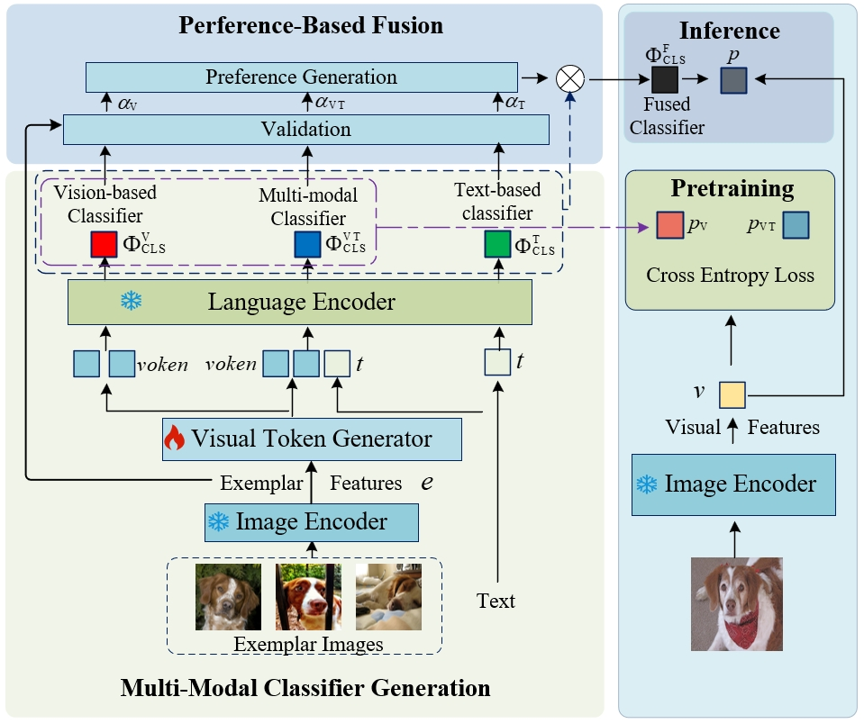
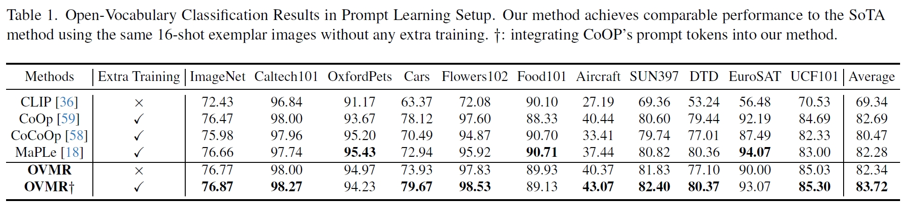
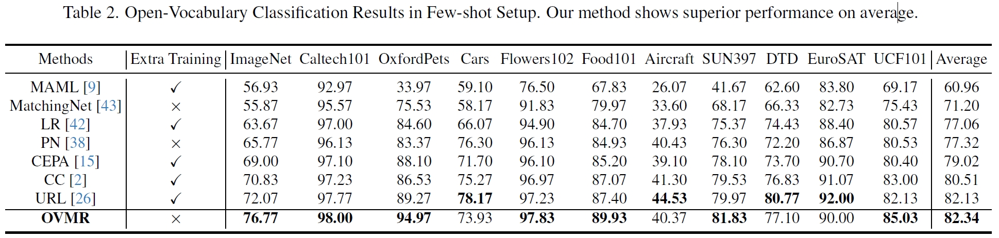
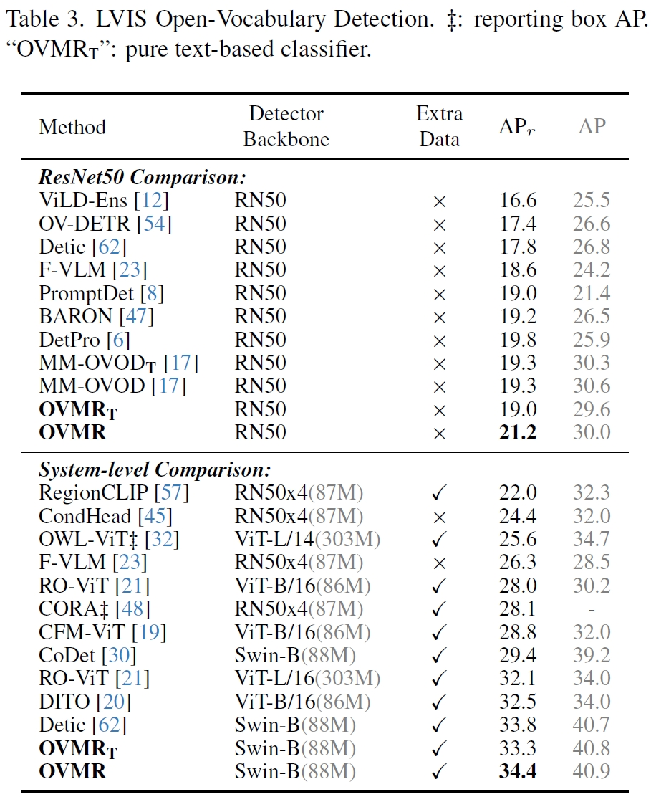
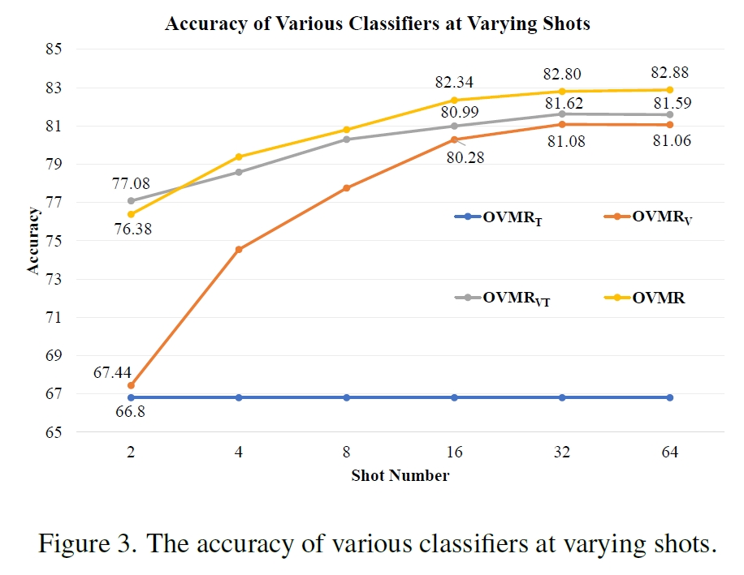

# OVMR: Open-Vocabulary Recognition with Multi-Modal References

[[Paper]](https://openaccess.thecvf.com/content/CVPR2024/papers/Ma_OVMR_Open-Vocabulary_Recognition_with_Multi-Modal_References_CVPR_2024_paper.pdf)

This repo is official implementation of **OVMR**: Open-Vocabulary Recognition with Multi-Modal References. 

## Abstract

The challenge of open-vocabulary recognition lies in the model has no clue of new categories it is applied to. Existing works embed category cues into model through few-shot fine-tuning or providing textual descriptions to vision-language models.  Few-shot fine-tuning with exemplar images is time-consuming and degrades the generalization capability. Textual descriptions could be ambiguous and fail to depict visual details. **Our finetuning-free OVMR embed multi-modal category clues into vision-language models with two plug-and-play modules.**


## Highlights

+ [2024.09.30] The code for open-vocabulary classification has been released. 

<p align="center">
    
</p>


## Environment

```bash
git clone https://github.com/Zehong-Ma/OVMR.git
cd OVMR
conda create -n ovmr python=3.10
conda activate ovmr
conda install pytorch==2.0.1 torchvision==0.15.2 torchaudio==2.0.2 pytorch-cuda=11.7 -c pytorch -c nvidia
pip install -r requirements
cd ./Dassl.pytorch
pip install -e .
```

## Train

### Data

+ Download imagenet21k datasets and extract files.

+ Create a soft link of imagenet21k in `data` folder

  ```bash
  mkdir -p ./data/imagenet21k/
  ln -s /path/to/imagenet21k ./data/imagenet21k/images
  ```

+ download the `imagenet21k-OVR` from [here](https://huggingface.co/datasets/zehongma/ImageNet21k_OVR). Put `imagenet21k_OVR_classnames.txt` into `./data/imagenet21k/` and  `shot_64-seed_1.pkl` into `./data/imagenet21k/split_fewshot/`. The structure will look like:

  ```bash
  data
  |–– imagenet21k/
  |   |–– imagenet21k_OVR_classnames.txt
  |   |–– split_fewshot/
  |   |   |–– shot_64-seed_1.pkl
  |   |–– images/
  |   |   |––n00004475
  |   |   |––n00005787
  |   |   |––...
  ```

    

### Scripts

+ Change the available GPU ID in the training script. 

+ Run the following script to reproduce our results in open vocabulary classification.

  ```bash
  sh train.sh
  ```

## Inference

### Data

+ Follow [DATASETS.md](./docs/DATASETS.md) to install the datasets and put these datasets into `data` folder.  Thanks for the awesome work [CoOp](https://github.com/KaiyangZhou/CoOp).

+ If you have downloaded these datasets before, please create a soft link through:

  ```
  ln -s /root/path/to/CoOp/dataset/* ./data/
  ```

+ The final structure will look like:

  ```
  data
  |–– imagenet21k/
  |–– imagenet/
  |   |   |–– images/
  |   |   |–– train/ # contains 1,000 folders like n01440764, n01443537, etc.
  |   |   |–– val/
  |   |   |--classnames.txt
  |–– caltech-101/
  |–– dtd/
  |–– eurosat/
  |–– ...
  ```

### Scripts

+ The mode`fusion`, `vision`, `multimodal` represent the final fused classifier, the vision-basd classifier, and the multi-modal classifier, respectively. 

+ Get the open vocabulary classification results in prompt learning setup by:

  ```bash
  sh eval.sh
  ```

## Generate Classifiers for Customized Datasets

### Pretrained Weights
+ download the pretrained weights of visual token generator from [here](https://drive.google.com/file/d/1gnhzomp4hKHBnQs65VtpxTSCd95S1p_T/view?usp=drive_link)

### Customized Dataset
+ Please adapt the file(`./datasets/imagenet.py`) for your datasets. You should split your dataset into `train` and `test` set, where the `train` set will be utilized as `eval_set` to generate multi-modal classifiers. Please carefully read each line in `./datasets/imagenet.py` and then modify the code.
+ Register your dataset in `./configs/datasets` by creating a new yaml.

### Scripts
+ Run the following command and you will find the `mm_classifiers.pt` in the dir `ourput_ovmr`. Utilize the classifiers(`text_classifier(Original CLIP)`, `vision_classifier`, `mm_classifier`) in `mm_classifiers.pt` to replace the open-vocabulary classifier in your project.
  ```bash
  bash scripts/mm_cls/generate_classifier.sh <Your_Dataset_Name> 1 base 2 fusion 10 0
  ```

## Results

### Open-Vocabulary Classification

+ Few-Shot Prompt Learning Methods

<p align="center">
    
</p>

+ Traditional Few-shot Methods

<p align="center">
    
</p>


### Open-Vocabulary Detection

<p align="center">
  
</p>

### The Influence of  Exemplar Image's Number.

<p align="center">
    
</p>

## Citation

```bash
@InProceedings{Ma_2024_CVPR,
    author    = {Ma, Zehong and Zhang, Shiliang and Wei, Longhui and Tian, Qi},
    title     = {OVMR: Open-Vocabulary Recognition with Multi-Modal References},
    booktitle = {Proceedings of the IEEE/CVF Conference on Computer Vision and Pattern Recognition (CVPR)},
    month     = {June},
    year      = {2024},
    pages     = {16571-16581}
}
```

