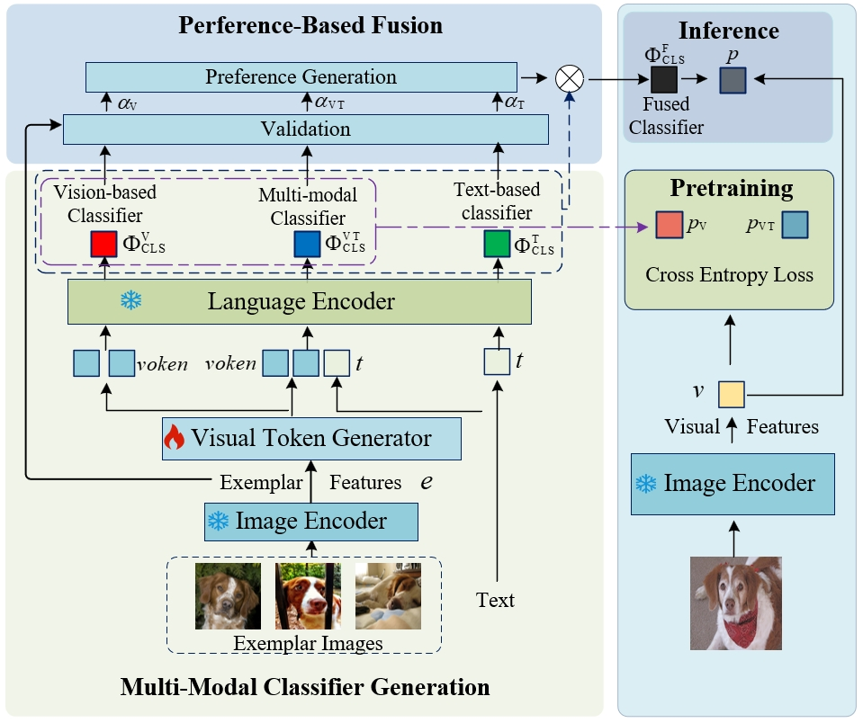
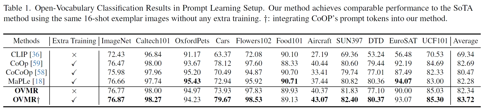
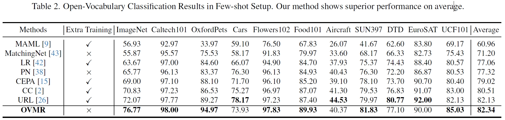
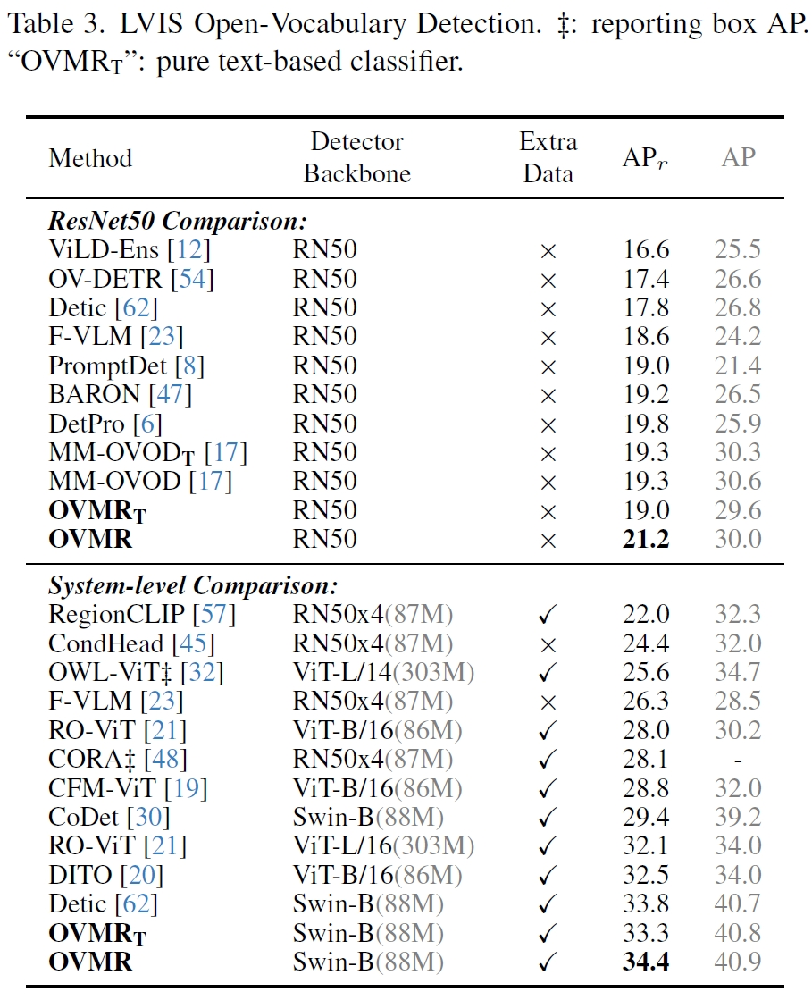
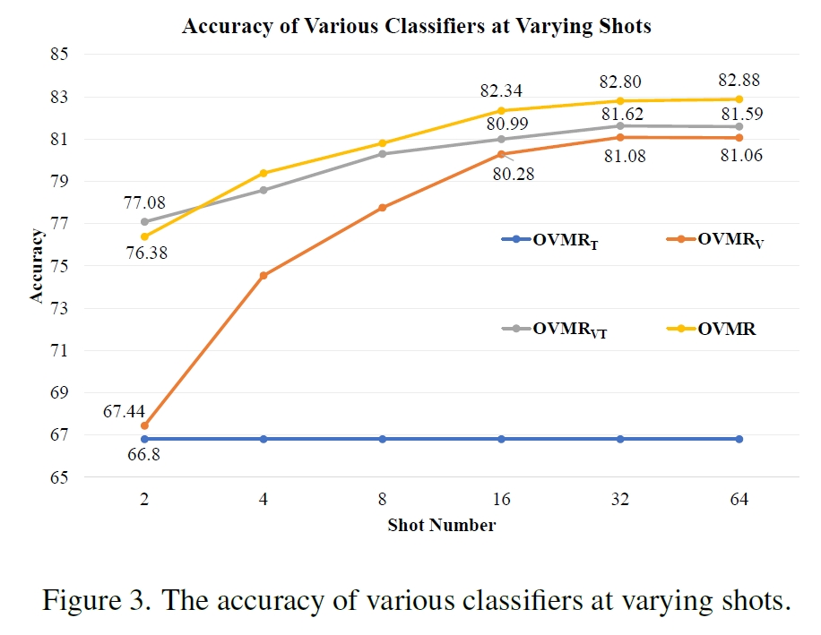

# OVMR: Open-Vocabulary Recognition with Multi-Modal References

[[Paper]](https://github.com/Zehong-Ma/OVMR/blob/master/papers/CVPR24_0325.pdf)

This repo is official implementation of OVMR. The code will be released soon.

## Abstract

The challenge of open-vocabulary recognition lies in the model has no clue of new categories it is applied to. Existing works embed category cues into model through few-shot fine-tuning or providing textual descriptions to vision-language models.  Few-shot fine-tuning with exemplar images is time-consuming and degrades the generalization capability. Textual descriptions could be ambiguous and fail to depict visual details. **Our finetuning-free OVMR embed multi-modal category clues into vision-language models with two plug-and-play modules.**

## Highlights

## Results

### Open-Vocabulary Classification

+ Few-Shot Prompt Learning Methods

+ Traditional Few-shot Methods

### Open-Vocabulary Detection

### The Influence of  Exemplar Image's Number.

